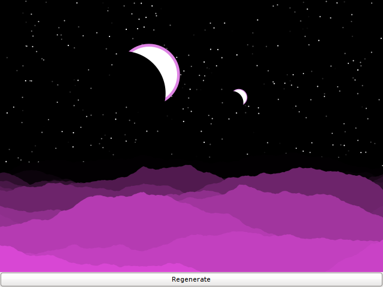
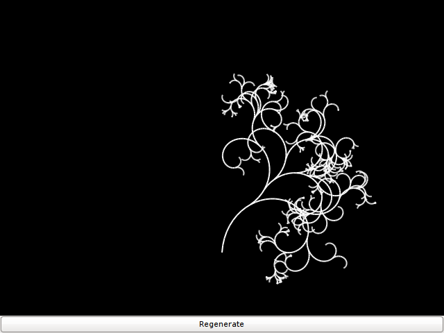
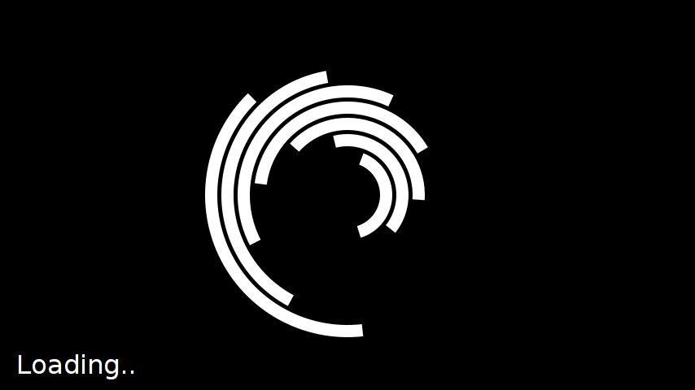
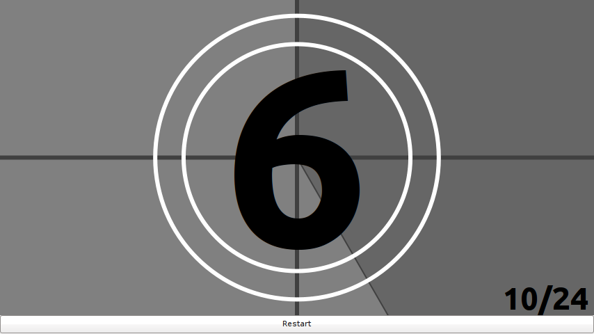

Cairo Gadgets
=============

A collection of random gadgets written in Cairo along with a helper
class that makes it trivial to write them. A minimal "Hello World"
example would look like this:

    def draw(ctx):
        cr = ctx.cr
        cr.move_to(ctx.width / 2, ctx.height / 2)
        cr.show_text("Hello World")

    def main()
        from cairogadget import Applet
        applet = Applet()
        applet.set_size(854, 480)
        applet.set_title("Hello World")
        applet.run(draw)

    if __name__ == "__main__":
        main()

Animation can be done via:

    applet.run_animation(draw, msec=1000 / 30)

Screenshots
-----------

